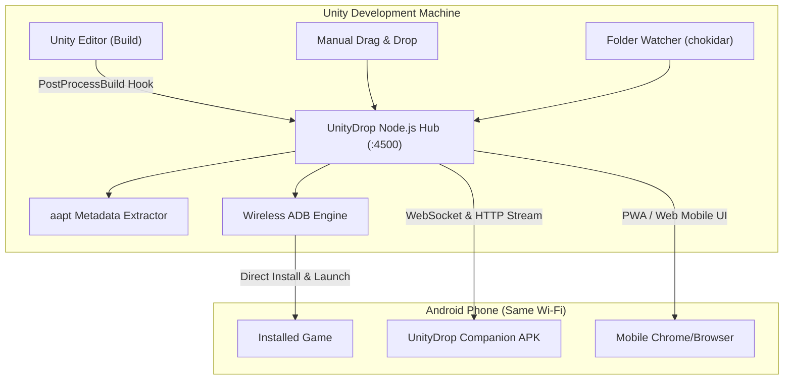

<div align="center">

# 🎮 UnityDrop

**Instant Local Wi-Fi APK Deployment, Wireless ADB & Live Testing Hub for Unity Developers**

[](https://opensource.org/licenses/MIT)
[](https://nodejs.org/)
[](https://unity.com/)
[](https://developer.android.com/)

Say goodbye to uploading APKs to Google Drive, waiting for processing, downloading on your phone, and fighting file managers.  
**Deploy Unity Android builds to your phone over local Wi-Fi in 2–5 seconds!**

[Features](#-features) • [Quick Start](#-quick-start) • [Unity Integration](#-unity-editor-integration) • [Wireless ADB](#-wireless-adb-setup) • [Architecture](#-architecture)

</div>

---

## ⚡ Why UnityDrop?

| Traditional Drive / Cloud Workflow | UnityDrop Local Hub Workflow |
| :--- | :--- |
| ❌ Upload 50–200 MB over internet upload speed (minutes) | 🚀 **Transfer over Gigabit Wi-Fi at 30–100 MB/s (1–3 seconds)** |
| ❌ Drive app sync delays & caching bugs | ⚡ **Zero internet used; runs completely on your local router** |
| ❌ Manual download & searching in phone downloads | 📲 **Instant install notification & 1-tap install** |
| ❌ Manual copy-pasting of links & test keys | 📋 **Seamless 3-Way Clipboard Sync (PC → Mobile & Mobile → PC)** |
| ❌ Phone interaction needed every single build | 🤖 **Zero-Touch Mode: auto-installs & launches game via Wireless ADB** |

---

## 🌟 Features

- 📂 **Automatic Unity Build Watcher**: Monitors your Unity `Builds/` folder. The millisecond Unity finishes compiling, the APK is prepared and announced to your devices.
- ⚡ **Zero-Touch Wireless ADB Deploy**: Pair your Android phone over Wi-Fi once. When Unity finishes building, UnityDrop automatically installs the APK and launches the game on your phone—without touching the phone screen!
- 📋 **Seamless 3-Way Clipboard Sync**: Instant real-time clipboard synchronization with 3 modes: `PC → Mobile` (copy on PC, pastes immediately on phone), `Mobile → PC` (copy on phone, pastes immediately on PC), and `Off`.
- 📲 **Ultra-Lightweight Android Companion App (16 KB)**: Built-in native companion APK with automatic install triggers.
- 🌐 **Zero-Install Web/PWA Client**: Scan the QR code on your PC screen with your phone's camera, bookmark the page, and enjoy 1-tap download & install.
- 🔍 **Automated APK Metadata Inspection**: Extracts package name, version, SDK levels, and game label using `aapt`.
- 📸 **Live Phone Screen Capture**: Grab instant snapshots from the running device directly in your PC browser.
- 🔔 **Melodic Synthesizer Chimes**: Web Audio API notification sounds when your build is ready so you can multitask freely.
- 🌐 **Multi-Language**: Instant toggle between English and Turkish.

---

## 🚀 Quick Start

### 1. Requirements
- [Node.js](https://nodejs.org/) (v18 or higher)
- Android SDK Platform-Tools (`adb`) — automatically detected from Unity Hub or Android Studio!

### 2. Run the Hub
Clone the repository and install dependencies:
```bash
git clone https://github.com/yourusername/unitydrop.git
cd unitydrop
npm install
npm start
```
Or simply double-click **`start-hub.bat`** on Windows!

1. Open the PC dashboard at **`http://localhost:4500`**.
2. Connect your phone to the same Wi-Fi network.
3. Scan the QR code with your phone camera or connect via Wireless ADB.

---

## 🎮 Unity Editor Integration

Want seamless 1-click deployment straight from the Unity Editor?

1. Copy the [`unity-package/Editor`](./unity-package/Editor) folder into your Unity project's `Assets/Editor/` directory.
2. In Unity, open **`Tools -> UnityDrop Hub 🚀`** to view your hub status.
3. Every time you build your game (`Ctrl + B`), the `UnityDropBuildHook` automatically notifies the local server to distribute or wireless-deploy your build!

---

## 📶 Wireless ADB Setup (1 Minute)

1. On your phone: **Settings -> About Phone -> Software Information -> Tap "Build Number" 7 times** to unlock Developer Options.
2. Go to **Settings -> Developer Options -> Enable "Wireless Debugging"**.
3. Tap **"Wireless Debugging"** to view your device's **IP Address & Port** (e.g., `192.168.1.50:37855`).
4. In UnityDrop's PC Dashboard, enter the IP & Port and click **"Connect"**.
5. Done! Check **"Auto-install on new build"** for completely hands-free testing.

---

## 🏗️ Architecture



---

## 📄 License

Distributed under the **MIT License**. See `LICENSE` for more information.

---

<div align="center">
Made with ❤️ for Game Developers
</div>