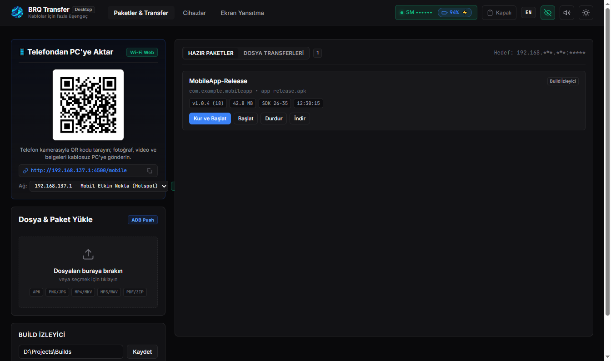
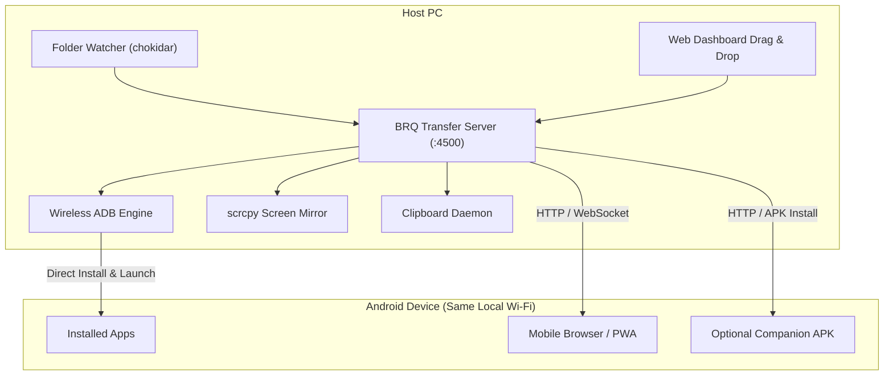

# BRQ Transfer

High-speed local Wi-Fi file transfer, wireless ADB manager, live screen mirroring, and clipboard sync hub between PC and Android devices.



This tool was created with AI assistance to remove daily friction in moving files, managing Android devices, and testing mobile applications without physical cables or cloud workarounds.

---

## Why BRQ Transfer?

Moving files between a PC and an Android phone or testing mobile applications typically relies on two conventional methods:

1. **USB Cables**: Physical cables wear out ports over time, restrict device movement during testing (gyroscope, orientation, camera), and easily disconnect when moved.
2. **Cloud Services (Drive, Dropbox, Messaging Apps)**: Uploading 100 MB to 1 GB files (recordings, media, app builds) depends on external internet upload speeds, applies cloud processing delays, and requires manual downloading and searching through phone folders.

### The Solution
BRQ Transfer connects your PC and Android devices directly over your local Wi-Fi network (LAN):
- **Gigabit Local Speeds**: Transfers run at full router bandwidth (30–80+ MB/s over 5 GHz Wi-Fi) with 0 KB internet data usage.
- **Universal Bidirectional Transfer**: Send any file format (photos, videos, documents, music, APKs) from PC to phone, or upload from phone back to PC.
- **Zero-Install Web Access**: Connected phones only need to scan a QR code with their camera to access the transfer dashboard in their mobile browser.
- **Wireless ADB Engine**: Manage devices, install apps, launch packages, and inspect device telemetry over Wi-Fi without cables.
- **Real-Time Clipboard Sync**: Seamlessly synchronize copied text between PC and Android in both directions.
- **Low-Latency Screen Mirroring**: View and interact with your Android display on your PC at 60 FPS.

---

## Use Cases

- **Everyday File Transfers**: Quickly move camera recordings, music albums, PDFs, or photos between your PC and Android phone without hunting for USB cables or uploading to third-party servers.
- **App & Game Developers**: If you build mobile apps or games (e.g. in Unity, Flutter, React Native, or Android Studio), BRQ Transfer can watch your build folder, automatically detect new APKs, install them over Wireless ADB, and launch them on your device hands-free.
- **Device Management & Testing**: Control phone navigation buttons, capture screenshots, check battery telemetry, and mirror screens during presentations or testing.

---

## Security & Important Safety Warnings

> [!WARNING]
> **Use on Trusted Private Networks Only**
> BRQ Transfer runs on your local network (LAN) on port 4500 and is designed for ease of use without complex authentication barriers. **Never run this application on public or untrusted Wi-Fi networks** (such as cafes, airports, or hotels) where unknown devices share the same network. Only run it on private, password-protected home or office networks.

> [!IMPORTANT]
> **Wireless ADB Security**
> Wireless ADB grants direct command-level access to your Android device (including installing/uninstalling packages, rebooting, and input simulation). Only pair and connect to Android devices that you personally own. Always verify the device IP before initiating a connection.

> [!CAUTION]
> **Third-Party Package Caution**
> Do not transfer or install APKs from unknown or unverified sources. Installing untrusted packages can compromise your mobile device.

> [!TIP]
> **Privacy / Streamer Mode**
> If you are screen-sharing, recording videos, or livestreaming, enable **Privacy Mode** (the eye icon in the top-right corner of the dashboard). This will automatically mask local IP addresses, device serial numbers, and sensitive hardware identifiers.

---

## Features

- **Bidirectional File Transfer**:
  - **PC to Mobile**: Drag and drop any file onto the web dashboard for immediate download to `/sdcard/Download`.
  - **Mobile to PC**: Upload photos, videos, recordings, or documents directly from your phone's browser or companion app to your PC's `received/` folder.
- **Wireless ADB Management**:
  - One-click connect via IP & Port.
  - Android 11+ Wireless Debugging QR code pairing with automatic port resolution.
  - Direct APK installation, package uninstallation, force stop, and app launch.
  - Remote navigation controls (Back, Home, App Switch, Power).
- **Bidirectional Clipboard Synchronization**:
  - `PC → Mobile`: Text copied on PC is automatically sent to the phone's clipboard.
  - `Mobile → PC`: Text copied on phone is automatically received on PC.
  - `Off`: Toggle synchronization off when not needed.
- **High-FPS Screen Mirroring**: Integrated `scrcpy` engine for viewing and controlling your Android device at 60 FPS with low latency.
- **Build Watcher & Developer Hooks**:
  - Automatically monitors configured folders for newly exported APKs.
  - Includes optional editor post-build scripts (`plugins/`) for developers wanting instant zero-touch testing upon compilation.
- **Device Telemetry & Battery Monitor**: Real-time display of battery percentage, charging state, and device identifiers.

---

## Quick Start

### Requirements
- [Node.js](https://nodejs.org/) (v18 or newer recommended)
- Android SDK Platform-Tools (`adb`) in PATH (automatically detected if installed via Android Studio or Unity Hub)

### Installation & Run

#### Option A: Quick Start (Windows)
1. Clone or download the repository:
   ```bash
   git clone https://github.com/b3rq/BRQ-Transfer.git
   cd BRQ-Transfer
   ```
2. Double-click **`start.bat`** (or **`launch.vbs`** for silent background execution).
   - On the first run, it automatically installs required dependencies (`npm install`) and opens the native desktop application window.

#### Option B: Manual CLI
1. Clone and enter directory:
   ```bash
   git clone https://github.com/b3rq/BRQ-Transfer.git
   cd BRQ-Transfer
   ```
2. Install dependencies:
   ```bash
   npm install
   ```
3. Start the application:
   - Desktop App: `npm run desktop`
   - Headless Web Server: `npm start` (Dashboard opens at `http://localhost:4500`)

---

## Wireless ADB Setup

For Android 11 and newer:

1. Enable Developer Options on your phone (Settings -> About Phone -> tap Build Number 7 times).
2. Go to **Settings -> Developer Options -> Wireless Debugging** and enable it.
3. Tap **Wireless Debugging** to see your device IP address and port (e.g. `192.168.1.50:37855`).
4. On the BRQ Transfer PC dashboard, enter the IP and port, then click **Connect** (or use the QR pairing tab).
5. Enable **Auto-install on new build** for hands-free updates.

---

## Architecture



---

## Repository Structure

```
BRQ-Transfer/
├── android-companion/    # Optional lightweight Android companion app source
├── docs/                 # Documentation assets and dashboard screenshots
├── plugins/              # Optional editor and build hook scripts
├── public/               # PC & Mobile web dashboards (HTML, CSS, JS)
├── tools/                # Clipboard sync and platform helper binaries
├── server.js             # Core Node.js server, WebSocket, ADB manager
├── electron.js           # Native desktop application wrapper
├── start.bat             # Windows one-click auto-installer & desktop launcher
├── start-hub.bat         # Windows console launcher shortcut
└── launch.vbs            # Silent background launcher (no console window)
```

---

## License

Distributed under the MIT License. See `LICENSE` for details.
