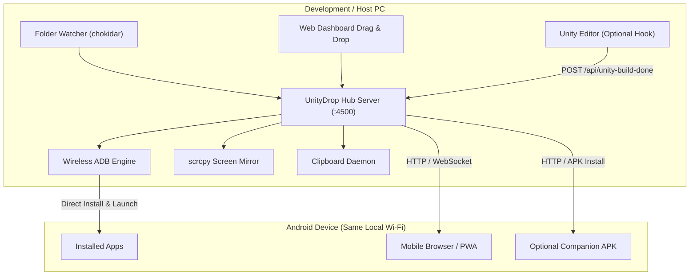

# UnityDrop

High-speed local Wi-Fi file transfer, wireless ADB manager, live screen mirroring, and clipboard sync hub between PC and Android devices.

This project was built with AI assistance to eliminate friction in daily Android device management, wireless file transfers, and mobile development workflows.

---

## The Problem & Why UnityDrop

Transferring files, testing APK builds, and controlling Android devices from a PC usually relies on two common methods:

### 1. USB Cable Tethering
- Physical cables wear out charging ports through repeated plugging and unplugging.
- Testing motion, gyroscope, camera, or general handheld use is awkward while physically tethered to a desk.
- Accidental cable nudges can interrupt active transfers or ADB sessions.

### 2. Cloud Storage (Google Drive / Dropbox / WeTransfer / Messaging Apps)
- Uploading large files (videos, assets, 100 MB to 500 MB APKs) consumes external internet bandwidth and takes several minutes.
- Cloud providers introduce processing, upload, and virus-scanning delays.
- On the phone, you have to manually open the app, find the download, save it, and hunt for it in file managers.

### The UnityDrop Solution
UnityDrop runs locally on your Wi-Fi router (LAN). It directly connects your PC and Android devices:
- **Universal Bidirectional File Transfer**: Send any file (photos, videos, music, documents, APKs) from PC to phone, or upload from phone back to PC at full local network speeds (often 30–80+ MB/s) with zero internet consumption.
- **Wireless ADB Engine**: Connect over Wi-Fi with one click or QR pairing. Install APKs, launch apps, send key events, and monitor battery status without cables.
- **Zero-Touch APK Auto-Install**: Automatically detects compiled APKs (from folder watching or Unity Editor) and silently installs and launches them on your connected device.
- **Bidirectional Clipboard Sync**: Seamlessly sync text between PC and mobile clipboard in real time.
- **Live 60 FPS Screen Mirroring**: View and control your Android screen directly from your PC desktop with ultra-low latency.
- **Zero-Install Web Client**: Any device on your local network can connect instantly by scanning a QR code in any browser—no mandatory companion app installation required.

---

## Features

- **Bidirectional File Transfer**:
  - **PC to Mobile**: Drag and drop any file onto the web dashboard for instant download to `/sdcard/Download`.
  - **Mobile to PC**: Upload photos, videos, recordings, or documents directly from your phone's browser or companion app to your PC's `received/` folder.
- **Wireless ADB Management**:
  - One-click connect via IP & Port.
  - Android 11+ Wireless Debugging QR code pairing with automatic port discovery.
  - Direct APK installation, package uninstallation, force stop, and app launch.
  - Remote navigation controls (Back, Home, App Switch, Power).
- **Bidirectional Clipboard Synchronization**:
  - `PC → Mobile`: Text copied on PC is automatically sent to the phone's clipboard.
  - `Mobile → PC`: Text copied on phone is automatically received on PC.
  - `Off`: Easily toggle synchronization off when not needed.
- **High-FPS Screen Mirroring**: Integrated `scrcpy` engine for viewing and controlling your Android device at 60 FPS with low latency.
- **Automatic Build Watcher & Unity Hook**:
  - Monitors configured folders for new APK builds.
  - Includes an optional Unity Editor post-build script for instant game testing upon compilation (`Ctrl + B`).
- **Device Telemetry & Battery Monitor**: Real-time display of battery percentage, charging state, and device identifiers.
- **Privacy / Streamer Mode**: One-click toggle on the dashboard to mask IP addresses, device serials, and sensitive identifiers.

---

## Quick Start

### Requirements
- [Node.js](https://nodejs.org/) (v18 or newer recommended)
- Android SDK Platform-Tools (`adb`) in PATH (automatically detected if installed via Android Studio or Unity Hub)

### Installation & Run

1. Clone the repository:
   ```bash
   git clone https://github.com/yourusername/unitydrop.git
   cd unitydrop
   ```

2. Install dependencies:
   ```bash
   npm install
   ```

3. Start the hub:
   ```bash
   npm start
   ```
   *Windows shortcut:* Double-click `start-hub.bat` or `launch.vbs` (runs quietly in background).

4. Open the PC dashboard at:
   ```
   http://localhost:4500
   ```

5. Connect your phone to the same Wi-Fi network and scan the QR code displayed on the dashboard.

---

## Optional: Unity Editor Integration

If you use Unity, you can deploy builds automatically:

1. Copy the `unity-package/Editor` folder into your Unity project's `Assets/Editor/` directory.
2. In Unity, open: **Tools -> UnityDrop Hub**.
3. Every time you trigger an Android build (`Ctrl + B`), the hook automatically notifies UnityDrop to deploy the APK.

---

## Wireless ADB Setup

For Android 11 and newer:

1. Enable Developer Options on your phone (Settings -> About Phone -> tap Build Number 7 times).
2. Go to **Settings -> Developer Options -> Wireless Debugging** and enable it.
3. Tap **Wireless Debugging** to see your device IP address and port (e.g. `192.168.1.50:37855`).
4. On the UnityDrop PC dashboard, enter the IP and port, then click **Connect**.
5. Enable **Auto-install on new build** for zero-touch updates.

---

## Architecture



---

## Repository Structure

```
unity-apk-hub/
├── android-companion/    # Optional lightweight Android companion app source
├── public/               # PC & Mobile web dashboards (HTML, CSS, JS)
├── tools/                # Clipboard sync and platform helper binaries
├── unity-package/        # Optional Unity Editor integration script
├── server.js             # Core Node.js server, WebSocket, ADB manager
├── start-hub.bat         # Windows launch script
└── launch.vbs            # Background launcher (no console window)
```

---

## License

Distributed under the MIT License. See `LICENSE` for details.
