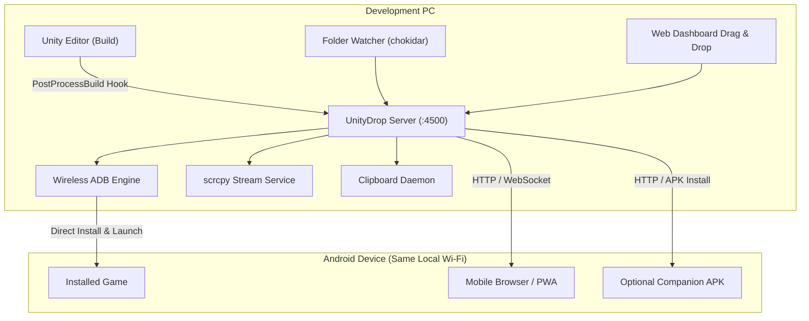

# UnityDrop

Local Wi-Fi APK deployment, wireless ADB manager, and testing hub for Unity and Android developers.

This project was built with AI assistance to eliminate repetitive friction in daily Android game development and mobile QA testing workflows.

---

## The Problem & Why UnityDrop

Testing Android builds during active development usually relies on two common methods, both of which introduce friction:

### 1. USB Cable Tethering
- Physical cables wear out charging ports through repeated plugging and unplugging.
- Testing motion, gyroscope, AR, or handheld comfort is awkward while tethered to a desk.
- Accidental cable nudges can disrupt data transfer mid-install.

### 2. Cloud Storage (Google Drive / Dropbox / WeTransfer)
- Uploading 100 MB to 500 MB builds depends on external internet upload speed and can take several minutes per iteration.
- Cloud services apply virus-scanning or processing delays before download links become active.
- On the phone, you must manually open the cloud app, wait for the file to appear, download it, locate it in the file manager, and trigger the package installer.

### The UnityDrop Solution
UnityDrop runs entirely on your local Wi-Fi network (LAN). It bridges your PC and test devices directly:
- **Fast Local Transfer**: Transfers run at full local network bandwidth (often 30 to 80+ MB/s over 5 GHz Wi-Fi), finishing in 2-5 seconds with zero internet data usage.
- **Zero-Touch Deployment**: When paired with Wireless ADB, building in Unity triggers an automatic background install and launches the game on your device without touching the phone.
- **Bidirectional Sharing**: Send test APKs and assets from PC to device, and upload screenshots, logs, or recordings from device back to PC.
- **Zero-Friction Access**: Any phone on the same network can access the hub simply by scanning a QR code with its camera. No mandatory app store downloads required.

---

## Features

- **Automatic Build Watcher**: Monitors your Unity build output directory. As soon as an APK is compiled, UnityDrop detects it, extracts metadata, and notifies connected devices.
- **Unity Editor Integration**: Includes an optional Unity Editor script (`PostProcessBuild`) that hooks into `Ctrl + B` builds for instant deployment.
- **Wireless ADB Integration**: Connect to Android 11+ devices via Wireless Debugging. Supports auto-install on new build, app launch, log inspection, and remote reboot.
- **Bidirectional File Transfer**:
  - PC to Mobile: Drag and drop files onto the dashboard for instant download.
  - Mobile to PC: Upload files from your phone's browser or companion app to save them directly to your PC.
- **Bidirectional Clipboard Sync**:
  - PC to Mobile: Text copied on PC is automatically sent to the phone's clipboard.
  - Mobile to PC: Text copied on phone is automatically received on PC.
  - Off: Toggle synchronization off when not needed.
- **Live Screen Mirroring**: Integrated `scrcpy` engine allows viewing and controlling your Android device at low latency directly from your PC.
- **Device Status & Telemetry**: Monitor connected device battery percentage, charging state, and connection status in real time.
- **APK Metadata Parsing**: Automatically reads package name, version, min SDK, and app label using `aapt` or pure JS fallback.
- **Streamer / Privacy Mode**: One-click toggle to mask IP addresses, serial numbers, and device identifiers on the dashboard.

---

## Quick Start

### Requirements
- Node.js (v18 or newer recommended)
- Android SDK Platform-Tools (`adb`) in PATH (automatically detected if installed via Unity Hub or Android Studio)

### Installation & Run

1. Clone the repository:
   ```bash
   git clone https://github.com/yourusername/unitydrop.git
   cd unitydrop
   ```

2. Install dependencies:
   ```bash
   npm install
   ```

3. Start the hub:
   ```bash
   npm start
   ```
   *Windows shortcut:* Double-click `start-hub.bat` or `launch.vbs` (runs quietly in background).

4. Open the PC dashboard at:
   ```
   http://localhost:4500
   ```

5. Connect your mobile device to the same Wi-Fi network and scan the QR code displayed on the dashboard.

---

## Unity Editor Integration

To automatically deploy builds whenever you build inside Unity:

1. Copy the `unity-package/Editor` folder into your Unity project's `Assets/Editor/` directory.
2. In Unity, open the menu: **Tools -> UnityDrop Hub**.
3. Every time you trigger a build (`Ctrl + B`), the hook automatically notifies UnityDrop to distribute or install the new APK.

---

## Wireless ADB Setup

For Android 11 and newer:

1. Enable Developer Options on your phone (Settings -> About Phone -> tap Build Number 7 times).
2. Go to **Settings -> Developer Options -> Wireless Debugging** and turn it on.
3. Tap **Wireless Debugging** to see your device IP address and port (e.g. `192.168.1.50:37855`).
4. On the UnityDrop PC dashboard, enter the IP and port, then click **Connect**.
5. Enable **Auto-install on new build** for zero-touch updates.

---

## Architecture



---

## Repository Structure

```
unity-apk-hub/
├── android-companion/    # Optional lightweight Android companion app source
├── public/               # PC & Mobile web dashboards (HTML, CSS, JS)
├── tools/                # Clipboard sync and platform helper binaries
├── unity-package/        # Unity Editor integration script
├── server.js             # Core Node.js server, WebSocket, ADB manager
├── start-hub.bat         # Windows launch script
└── launch.vbs            # Background launcher (no console window)
```

---

## License

Distributed under the MIT License. See `LICENSE` for details.
